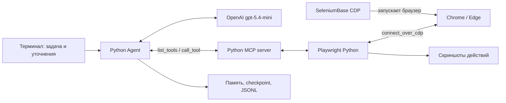

# Stealth Browser Agent

Автономный браузерный агент по [техническому заданию](https://kolbasa.craft.me/ai_test_task).
Получает задачу на обычном языке, исследует страницы, выбирает действия через
`gpt-5.4-mini` и исполняет их в видимом браузере. Интерфейс - терминальный чат.

Стек: **Python → OpenAI Responses API → MCP stdio → Playwright Python → SeleniumBase CDP → Chrome**.
На Windows при отсутствии Chrome автоматически используется установленный Edge.
В коде агента нет сценариев для конкретных сайтов, их селекторов или внутренних маршрутов.

## Быстрый запуск на Windows

Нужны Python 3.11+, Chrome (или Edge) и OpenAI API key с доступом к `gpt-5.4-mini`.
Все команды выполняются из каталога проекта в PowerShell.

```powershell
python -m venv .venv
.venv/Scripts/python.exe -m pip install -e '.[dev,video]'
Copy-Item .env.example .env
```

В `.env` заполните одну строку:

```dotenv
OPENAI_API_KEY=ваш_ключ
# Необязательно для совместимого прокси:
# OPENAI_BASE_URL=https://proxy.example/v1
```

Если `.env` уже существует, не перезаписывайте его. Ключ не нужно отправлять в чат.
Диагностика не выводит ключ и не делает платных запросов:

```powershell
.venv/Scripts/browser-agent.exe doctor
.venv/Scripts/browser-agent.exe login
.venv/Scripts/browser-agent.exe
```

`login` открывает отдельный постоянный профиль. Войдите в нужные аккаунты вручную,
затем нажмите Enter в терминале. При последующем запуске агент использует этот же профиль.
В чате напишите задачу; `/exit` завершает программу, Ctrl+C останавливает выполнение.
Не запускайте одновременно два агента с одним профилем.

Альтернативный запуск: `./scripts/start.ps1` устанавливает зависимости, создаёт `.env`
при его отсутствии и запускает чат. Активация PowerShell-окружения не требуется.

Одна задача без интерактивного ввода начального запроса:

```powershell
.venv/Scripts/browser-agent.exe --task "Открой https://example.com и расскажи, что находится на странице"
```

Вопросы агента при нехватке данных остаются интерактивными и в режиме `--task`.
Браузер виден по умолчанию; `--headless` предназначен для автоматических проверок.

Linux/macOS: создайте venv через `python3 -m venv .venv`, используйте `.venv/bin/python`
и `.venv/bin/browser-agent`. На Linux нужен установленный Chrome/Chromium; для видимого
режима - графическая сессия. На этой машине сквозной тест выполнялся в Windows.

## Как устроено решение



- **Stealthy Playwright Mode.** SeleniumBase `cdp_driver.start_async()` запускает
  браузер, Playwright подключается через `connect_over_cdp()` к его endpoint.
  Это режим, который описан в [официальных примерах SeleniumBase](https://github.com/seleniumbase/SeleniumBase/blob/master/examples/cdp_mode/playwright/ReadMe.md).
  Отдельная загрузка браузера через `playwright install` не нужна. Stealth не гарантирует
  прохождение антибот-проверок любого сайта; CAPTCHA и вход пользователь выполняет вручную.
- **Настоящий MCP.** Сервер работает отдельным процессом по stdio JSON-RPC на
  [официальном Python SDK](https://github.com/modelcontextprotocol/python-sdk/tree/v1.x).
  Клиент динамически получает `list_tools`, передаёт схемы модели, валидирует аргументы
  и выполняет `call_tool`. Агент не обращается напрямую к Playwright.
- **Почему собственный сервер.** [Chrome DevTools MCP](https://github.com/ChromeDevTools/chrome-devtools-mcp)
  использует Puppeteer. Здесь выбран разрешённый ТЗ альтернативный MCP-сервер, чтобы
  сами действия выполнялись через Playwright **на Python**, без второго Node.js-стека.
  Это не официальный сервер Google, а сервер этого проекта.
- **Автономный цикл.** Модель получает наблюдение, выбирает следующую команду,
  видит результат и пересматривает действия. `parallel_tool_calls=False` сохраняет
  последовательность операций над браузером. Неопределённый результат таймаута
  возвращается как ошибка с указанием сначала проверить состояние.
- **Извлечение страниц.** Accessibility tree, доступные подписи, DOM-метаданные,
  ссылки, список вкладок и iframe. Длинный снимок читается частями через `next_offset`.
  Для canvas/нестандартных контролов есть скриншот и координатное действие.
  Общие DOM-запросы извлекают структуру; сайтоспецифических селекторов в runtime нет.
  При открытом видимом HTML-диалоге область поиска автоматически ограничивается самым
  вложенным `dialog`/`role=dialog`/`aria-modal` окном: одноимённые элементы на затемнённом
  фоне не становятся целью. Снимок помечает такую область как `ACTIVE MODAL`, а ссылки
  на фоновые поля отклоняются до повторного осмотра после закрытия окна.
  По умолчанию возвращается компактное дерево. Атрибуты DOM включаются по запросу
  `browser_snapshot(include_metadata=true)`. iframe читаются параллельно, до четырёх
  одновременно. Полностью одинаковые наблюдения в контексте заменяются ссылками
  на исходный снимок; первичные данные остаются в журнале и checkpoint.
- **Контекст.** Исходная задача сохраняется отдельно. Длинная история сжимается
  моделью; остаются резюме, заметки и два последних полных шага с парными
  `function_call` / `function_call_output`. Encrypted reasoning возвращается API
  вместе с инструментальными результатами. Старые изображения удаляются из контекста.
  При передаче истории длинные наблюдения сокращаются локально: последнее примерно
  до четверти `AGENT_CONTEXT_CHARS`, остальные до одной шестнадцатой. Ошибки и перечень
  частично выполненных полей сохраняются. Полный результат можно прочитать частями
  через `read_observation` без нового обращения к браузеру. Оригиналы хранятся в истории,
  а после сжатия - в памяти текущего процесса. После перезапуска архив сжатых наблюдений
  недоступен этому инструменту: агент использует сохранённое резюме или свежий снимок.
  Платное сжатие выполняется лишь при превышении порога и достаточном объёме удаляемой
  истории. Порог не является жёстким лимитом токенов: исходный запрос и заметки не обрезаются.
- **Продвинутый паттерн: evaluator–optimizer.** `finish(completed)` инициирует
  новый снимок и отдельный вызов той же модели в роли проверяющего. Если доказательств
  недостаточно, замечание возвращается исполнителю, и работа продолжается.
  Проверяющий - дополнительная проверка, а не гарантия безошибочности LLM.
  Если модель вместо `finish` возвращает обычный текстовый ответ, он проходит
  такую же проверку; неподтверждённый ответ не завершает задачу.
  Если агент использовал скриншот или координатные действия, проверяющий получает
  новый скриншот через `input_image` в [Responses API](https://developers.openai.com/api/docs/guides/images-vision).
  Признак визуальной проверки сохраняется в checkpoint. Ошибка получения изображения
  не позволяет подтвердить успех такой задачи. Для обычной текстовой проверки
  дополнительный скриншот не запрашивается.
- **Восстановление.** Checkpoint пишется атомарно после каждого завершённого шага.
  Повторение одинаковой команды четыре раза подряд блокируется. Лимит шагов и
  прерывание дают `incomplete`/`interrupted`, а не ложное сообщение об успехе.

Интеграция использует [OpenAI function calling](https://developers.openai.com/api/docs/guides/function-calling)
и сохраняет указанную [модель gpt-5.4-mini](https://developers.openai.com/api/docs/models/gpt-5.4-mini).
API-запросы делаются с `store=False`; история для продолжения хранится локально.

## Инструменты MCP

| Инструмент | Назначение |
|---|---|
| `browser_snapshot` | Структура, метаданные, страницы, iframe, диалоги |
| `browser_navigate`, `browser_back` | Навигация |
| `browser_click`, `browser_fill`, `browser_press` | Клики, ввод, клавиатура |
| `browser_select`, `browser_check` | Списки, radio и checkbox |
| `browser_inspect_form`, `browser_fill_fields` | Вопросы, части анкеты, пакетное заполнение |
| `browser_scroll`, `browser_wait` | Прокрутка и динамический контент |
| `browser_tab` | Создание, выбор и закрытие вкладок |
| `browser_dialog` | Нативные alert, confirm, prompt без зависания клика |
| `browser_screenshot`, `browser_pointer` | Визуальное наблюдение и действия |

Локальные инструменты модели: `ask_user`, `knowledge_search`, `read_observation`, `remember`, `finish`.
Парольные поля и поля с `autocomplete=one-time-code` блокируются общей проверкой
в `browser_fill` и `browser_fill_fields`; пользователь заполняет их в браузере.
Произвольного JavaScript/eval, shell и чтения произвольных локальных файлов у модели нет.
Обработка скачанного файла и загрузка локальных вложений пока не реализованы.

## Настройки и продолжение

Все настройки описаны в `.env.example`. Основные:

| Переменная | По умолчанию |
|---|---|
| `OPENAI_MODEL` | `gpt-5.4-mini` |
| `OPENAI_BASE_URL` | пусто - стандартный адрес OpenAI |
| `AGENT_REASONING_EFFORT` | `low` |
| `AGENT_MAX_STEPS` | `100` вызовов исполнителя на запуск |
| `AGENT_MAX_API_CALLS` | `0`: без отдельного лимита; число запросов, включая сжатие и проверку |
| `AGENT_MAX_OUTPUT_TOKENS` | `5000`: предел выходных токенов каждого запроса |
| `AGENT_API_MAX_RETRIES` | `0`: автоматические повторные запросы отключены |
| `AGENT_CONTEXT_CHARS` | `32000`, порог сжатия текстовой истории |
| `AGENT_RECORD_ACTIONS` | `false`: кадры после действий сохраняются только при `true` |
| `AGENT_TOOL_TIMEOUT_SECONDS` | `45` |
| `AGENT_HEADLESS` | `false` |
| `AGENT_PROFILE_DIR` | `.browser-profile` |
| `AGENT_BROWSER_EXECUTABLE` | Поиск Chrome, затем Edge |
| `AGENT_CDP_URL` | Не задан: браузер запускается SeleniumBase |
| `AGENT_ARTIFACTS_DIR` | `artifacts` |

`AGENT_CDP_URL` позволяет подключиться к уже запущенному отладочному браузеру.
В таком режиме приложение не запускает SeleniumBase и не приписывает чужой сессии stealth;
при выходе внешний браузер не закрывается. CDP endpoint должен оставаться локальным.

При небольшом API-балансе можно задать в `.env`, например:

```dotenv
AGENT_MAX_API_CALLS=6
AGENT_MAX_OUTPUT_TOKENS=800
AGENT_REASONING_EFFORT=none
```

Лимит включает исполнителя, сжатие памяти, проверяющего результат и проверку необходимости
повторного уточнения при наличии данных в базе. При его достижении агент
сохраняет checkpoint и сообщает `incomplete`. Это ограничения числа запросов и
выхода, а не жёсткий лимит общей стоимости: входные токены тоже оплачиваются.
Каждый запуск/возобновление получает новый лимит; внутри чата лимит действует на задачу.
Для сложной многошаговой работы лимит потребуется увеличить.

Короткая живая проверка Chrome и API: `python scripts/live_smoke.py`.
Она читает код с небольшой локальной страницы, использует максимум 4 запроса по
600 выходных токенов, `reasoning=none`, без повторных попыток. Результат и фактический
расход токенов сохраняются в `artifacts/live-smoke-*/result.json`.

Точечные платные проверки исправлений: `python scripts/live_review_checks.py`.
По умолчанию до 3 запросов по 1000 выходных токенов, без повторов, на вымышленных
данных и отдельном профиле Chrome. Один случай (максимум один запрос) можно выбрать
через `--check known`, `--check missing` или `--check visual`. Последний проверяет
отклонение ложного успеха по надписи на canvas. В случае ошибки скрипт останавливается
и сохраняет результат с фактическим расходом в `artifacts/live-review-*/result.json`.
Каждый запуск платный и получает новый лимит; скрипт не запускается обычными тестами.

```powershell
.venv/Scripts/browser-agent.exe --resume artifacts/ИМЯ_СЕАНСА/checkpoint.json --max-steps 150
```

Возобновление перечитывает текущую страницу, поскольку браузер мог измениться.
Используйте прежний профиль. После Ctrl+C последнее незавершённое действие могло
успеть сработать: агент получает указание сначала проверить состояние.
В интерактивном чате отдельные задачи имеют отдельные checkpoint в подкаталогах `task-*`.

Артефакты: `events.jsonl`, `checkpoint.json`, `mcp-server.log`, `frame-*.png`.
Кадры создаются только при `AGENT_RECORD_ACTIONS=true`. В обычном режиме автоматические
скриншоты отключены, но инструмент `browser_screenshot` всегда доступен.
Журнал содержит длительность модельных и браузерных запросов для поиска задержек.
Консоль показывает короткие статусы с целью действия, без отправляемого текста формы
и длинных промежуточных пояснений модели. Перед вводом в поле или JS prompt символ
длинного тире (U+2014) заменяется на `-`; локаторы и адреса при этом не изменяются.
Журнал содержит вызовы инструментов и фактические результаты, но не скрытые рассуждения.
Известный API key маскируется; содержимое страниц и снимки могут содержать личные данные.
`.env`, профили и артефакты исключены из Git. Не публикуйте их вместе с исходниками.
Наблюдения страницы передаются OpenAI для выбора следующего действия.

## Анкеты и база знаний

Агент распознаёт вопросы рядом с полями, даже когда у нескольких полей одинаковая
подсказка «Писать тут». `browser_inspect_form` возвращает вопросы, значения, обязательность,
варианты и ошибки; `browser_fill_fields` заполняет несколько полей одним вызовом MCP.
После заполнения агент повторно осматривает форму на дополнительные вопросы.
Устаревшие ссылки на поля отклоняются; при ошибке пакет останавливается с перечнем
уже обработанных полей. Отправка выполняется отдельным действием и требует проверки результата.
Этот механизм общий для сайтов; нестандартные виджеты обрабатываются обычными инструментами.
Чтение следующих частей через `next_offset` и других iframe сохраняет прежние `ref`.
Повторное чтение того же диапазона заменяет только его ссылки. Смена активной страницы
при новом осмотре очищает ссылки; отключённые или изменившиеся элементы проверяются перед вводом.

Постоянная база находится в `.knowledge/facts.json`, путь задаётся через
`AGENT_KNOWLEDGE_PATH`. Изначально она пустая. Сведения из текущего запроса, рабочей
памяти и доступного резюме также используются для ответов. Для заранее внесённых
данных заполните список `facts` объектами с полями `question`, `answer` и `source`:

```json
{"facts": [{"question": "Навыки и опыт", "answer": "Ваши реальные сведения", "source": "user"}]}
```

Это пример формата, а не готовые сведения. Для зарплаты укажите сумму, валюту, период
и gross/net. Можно добавить несколько фактов, включая текст резюме и предпочтения.
Файл не публикуется в Git. Найденные сведения передаются модели как данные для задачи.
Сам поиск выполняется локально, без отдельного API-запроса или платных embeddings.

Перед уточнением агент проверяет базу. Если найдены ещё не прочитанные сведения,
вопрос пользователю откладывается, а сведения возвращаются модели. Только если их
недостаточно, запрашивается конкретный недостающий факт. Такие ответы сохраняются
между запусками. Ручной вход и согласования не записываются как сведения профиля.
Если агент повторно предлагает спросить при уже прочитанных совпадениях, отдельная
проверка моделью определяет, есть ли существенный пробел. Сам факт чтения больше
не разрешает вопрос. Например, при известной сумме без gross/net уточняется только
база расчёта. Проверка расходует API-токены, учитывается в `AGENT_MAX_API_CALLS` и
кэшируется для одинаковых вопросов, сведений и пользовательского контекста.
При изменении фактов или контекста требуется новая проверка; её точность зависит от модели.
Требования поля передаются проверяющему отдельно от сведений: формат gross в задаче
не считается доказательством, что сохранённая зарплата указана до налогов.
Мотивационные ответы агент формулирует самостоятельно на основе вакансии и известных
фактов; неизвестные навыки, опыт и зарплату не придумывает. `remember` остаётся памятью
отдельной задачи, а не постоянной базой знаний.

После обновления перезапустите программу, чтобы загрузить новые инструменты MCP.

## Проверки и воспроизводимый стенд

```powershell
.venv/Scripts/python.exe -m pytest -q
.venv/Scripts/python.exe -m ruff check src tests scripts
.venv/Scripts/python.exe -m pip check

# Настоящий браузер + отдельный MCP-процесс; OpenAI key не требуется:
$env:RUN_BROWSER_TESTS='1'
.venv/Scripts/python.exe -m pytest tests/test_browser_integration.py -q
```

Модульные тесты проверяют цикл, JSON-ошибки, сжатие истории, восстановление,
неподтверждённый успех, зацикливание, маскирование ключа, валидацию MCP и настоящий
OpenAI SDK с подменённым HTTP-транспортом. Последний проверяет сериализацию,
но не доступность модели или реальное качество её решений.

Интеграционный тест запускает локальный HTTP-сайт, SeleniumBase, Playwright и MCP,
проверяет формы, корзину, iframe, асинхронное обновление, нативный диалог,
скриншот, вкладки и восстановление после ошибки локатора. Фиксированные шаги и
селекторы есть **только в тесте**, не в агенте.

`requirements-lock-windows.txt` - зафиксированные версии проверенного Windows-окружения.
Воспроизведение: `pip install -r requirements-lock-windows.txt`, затем `pip install -e .`.
На других ОС устанавливайте через `pyproject.toml`, поскольку lock включает `pywin32`.

## Демонстрация для сдачи ТЗ

Локальный стенд позволяет показать многошаговую задачу без доступа к реальной почте.
В первом терминале:

```powershell
.venv/Scripts/python.exe -m http.server 8765 --bind 127.0.0.1 --directory tests/fixtures
```

Во втором:

```powershell
.venv/Scripts/browser-agent.exe --task "Открой http://127.0.0.1:8765. Прочитай письма на всех страницах и перемести очевидный спам в корзину. Сохрани важную рабочую переписку. В конце сообщи, какие письма перемещены и почему."
```

Эта задача даётся как пользовательский запрос. У агента нет доступа к файлам стенда,
заранее выбранным письмам или тестовому сценарию. Корзина здесь обратима и локальна.

После реального запуска можно собрать MP4 из скриншотов действий:
Перед запуском такого сеанса включите в `.env` параметр `AGENT_RECORD_ACTIONS=true`.

```powershell
.venv/Scripts/python.exe scripts/export_video.py artifacts/ИМЯ_СЕАНСА
```

Это покадровое воспроизведение действий, не непрерывная запись экрана; для видео с
терминалом и вопросами пользователя используйте обычную запись экрана во время запуска.
Кадры страниц не снимаются, пока открыт нативный JS-диалог.

Короткая проверка реальной модели с Chrome выполнена; подробности и фактический расход
токенов - в [отчёте](docs/verification.md). Полноценный многошаговый прогон ещё не выполнялся.
Техническое видео интеграционного теста не заменяет демонстрацию автономного решения.
Для сдачи потребуется реальный прогон, просмотр результата и публикация
исходников в выбранном Git-репозитории; удалённый репозиторий автоматически не создаётся.

## Структура

```text
src/browser_agent/
  agent.py        # цикл, память, evaluator–optimizer
  browser.py      # SeleniumBase, CDP, Playwright, снимки
  forms.py        # вопросы, поля, пакетное заполнение и проверка
  knowledge.py    # постоянные сведения и локальный поиск
  input_policy.py # общая проверка ручного ввода паролей и OTP
  server.py       # инструменты MCP
  mcp_client.py   # stdio bridge, discovery, schemas, images
  prompts.py      # общие инструкции без привязки к сайтам
  state.py        # checkpoint и JSONL
  config.py       # .env, типы, проверка настроек
  cli.py          # чат, login, doctor, resume
tests/            # offline и настоящий браузерный тест
scripts/          # запуск и экспорт видео
```
